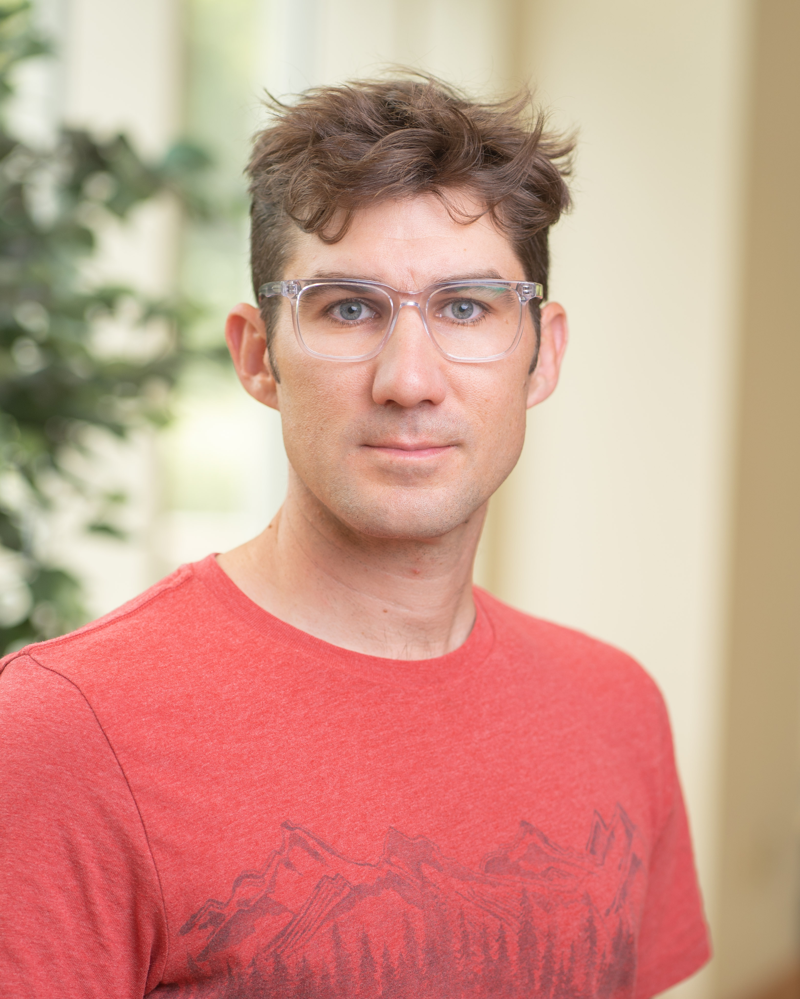

---
---

<link rel="stylesheet" href="styles.css" type="text/css">

I am an Associate Professor in the [Department of Geography](https://www.colgate.edu/academics/departments-programs/department-geography) at [Colgate University](https://www.colgate.edu/). In my lab we use field observations along with imagery from drones and satellites to answer questions related to changing vegetation structure and function. Our recent research has focused on how forest recovery after fire in Siberia can feed back to climate change, and also on how changes in Arctic vegetation influence permafrost. Most of our field work is conducted at the [Northeast Science Station](https://pleistocenepark.ru/north-east-science-station/) in Cherskiy, Russia. We are also leading several synthesis efforts through the [Permafrost Carbon Network](http://www.permafrostcarbon.org/).    

Before coming to Colgate I worked as a Postdoctoral Fellow with [Scott Goetz](https://goetzlab.rc.nau.edu/) at the [Woods Hole Research Center](https://whrc.org/) after completing my PhD with [Scott Mackay](http://water.geog.buffalo.edu/mackay/) in the [Department of Geography](http://www.buffalo.edu/cas/geography.html) at the University at Buffalo. I have a BS in Environmental Science from [West Virginia Wesleyan College](https://www.wvwc.edu/). My full CV is available [here](files/LORANTY_CV.pdf).

In my spare time I enjoy spending time outdoors with my family and riding bicycles. 